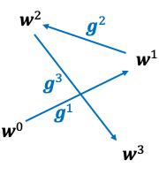
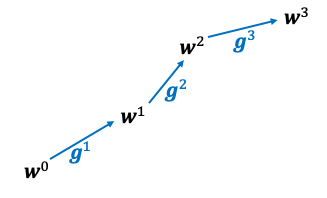

# PoisonedFL

The source code for the manuscript "Model Poisoning Attacks to Federated Learning via Multi-Round Consistency", accepted to CVPR 2025.

## Overview 
Model poisoning attacks are critical security threats to Federated Learning (FL). Existing model poisoning attacks suffer from two key limitations: 1) they achieve suboptimal effectiveness when defenses are deployed, and/or 2) they necessitate knowledge of the genuine model updates or genuine data. In this work, we make a key observation that their suboptimal effectiveness arises from only leveraging consistency among malicious clients within individual rounds, neglecting the potential for effective multi-round consistency.  Rather than accumulating, the cumulative effects of these attacks often self-cancel across rounds. In light of this observation, we propose PoisonedFL, which does not require any knowledge of the genuine clients and ensures accumulated attack effectiveness via multi-round consistency and dynamic attack magnitude adjustments guided by feedback.
Our empirical evaluation on five benchmark datasets shows that PoisonedFL breaks eight state-of-the-art defenses and outperforms seven existing model poisoning attacks. Moreover, we also explore new defenses that are tailored to PoisonedFL, but our results show that we can still adapt PoisonedFL to break them. Our study shows that FL systems are considerably less robust than previously thought, underlining the urgency for the development of new defense mechanisms. 





Comparison of exsiting attacks and PoisonedFL.

## Preparation

Our code is based on MXNet. Requried package:

> + mxnet (should match the cuda version)
> + numpy
> + scikit-learn

## Dataset
The Cifar-10, FashionMNIST, MNIST datasets are available in MXNet Data.

The purchase dataset is available at https://www.kaggle.com/c/acquire-valued-shoppers-challenge/data.

The FEMNIST dataset is available at https://github.com/TalwalkarLab/leaf.


## Usage
For reproduction of the experiments, please refer to scripts.

Example
```
$ python test_agr.py --dataset FashionMNIST --gpu 0 --net cnn --niter 6000 --nworkers 1200 --nfake 240 --aggregation median --byz_type poisonedfl --sf 8 --local_epoch 1
```
